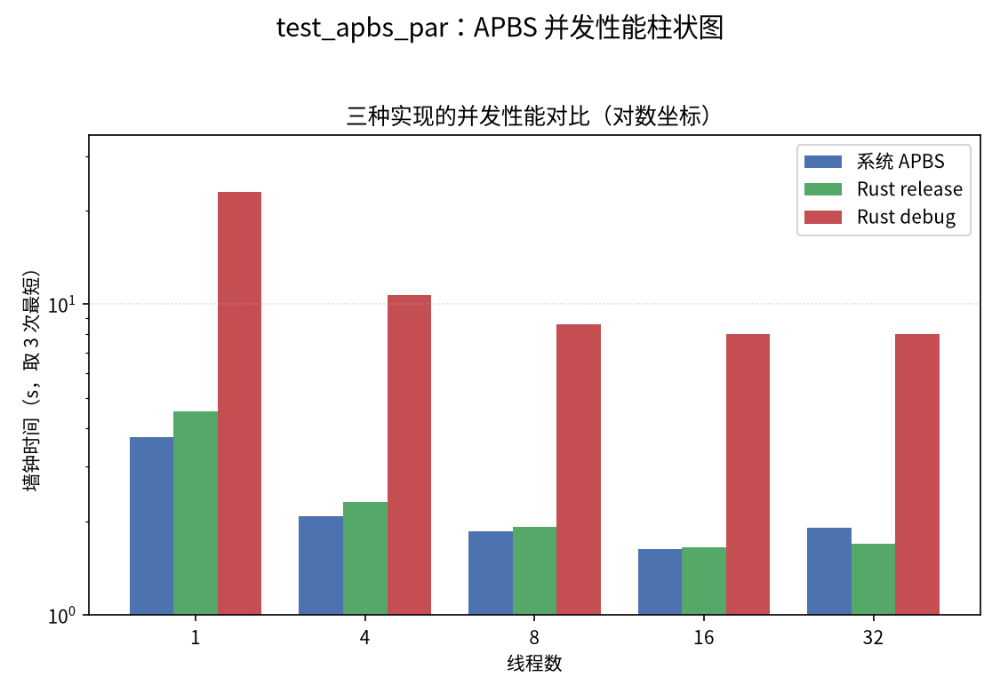

# apbs-rs

[APBS](https://github.com/Electrostatics/apbs)（Adaptive Poisson-Boltzmann
Solver）的 Rust 移植版，目标是在保持 APBS v3.4.1 输入语义与数值结果兼容的
前提下，用 Rust + Rayon 实现并行的泊松-玻尔兹曼方程求解。

## 当前状态

- 基于 APBS v3.4.1，支持 `mg-auto` 多重网格聚焦流程（如 NPBE）及 PQR 输入；
- release 构建在测试分子上与系统 APBS 性能基本持平，详见
  [bench_results](examples/test_apbs_par/bench_results/对比结果.md)。

## 目录结构

| Crate | 说明 |
| --- | --- |
| `apbs-core` | 主程序 `apbs` 与顶层流程（移植自 `src/main.c`、`src/routines.c`） |
| `apbs-generic` | 通用数据结构与物理参数（移植自 `src/generic/`） |
| `apbs-mg` | 多重网格 PBE 求解框架（移植自 `src/mg/`） |
| `apbs-pmgc` | MG 底层求解内核（移植自 `src/pmgc/`） |

## 构建与运行

```bash
cargo build --release
cd examples/test_apbs_par
../../target/release/apbs test.apbs
```

命令行与系统 APBS 类似：`apbs [-c FILE] input.in`。还提供
`-h/--help`、`-v/--version`、`--print-config-template` 和
`--generate-config [FILE]`。

## 并行性能



## 运行时配置

默认读取当前目录的 `apbs-rust.conf`（可用 `--generate-config` 生成带中英双语
注释的模板），也可用 `-c FILE` 指定其他文件；同名环境变量优先于配置文件。

常用开关：

- `APBS_RUST_DEBUG=1`：输出 Rust 调试日志；
- `RAYON_NUM_THREADS=N`：设置 Rayon 并行线程数；
- `APBS_RUST_NONLIN_SOLVER=newton`：原生非线性求解器（`mgfas` 为实验路径）。

## 参考

- 上游项目与输入文件格式文档：<https://apbs.readthedocs.io>
- License：BSD-2-Clause
